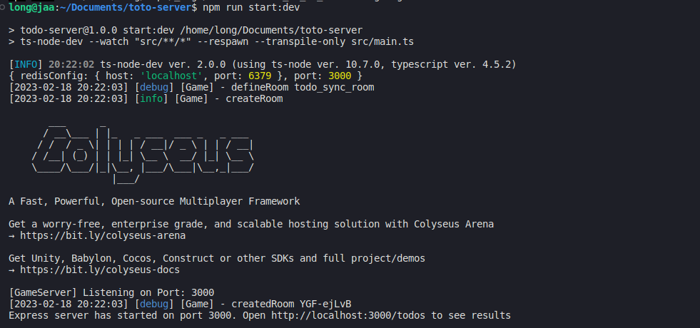

## Simple Todo Server

### Requirement
1. Docker and docker compose [Installation guilde](https://www.digitalocean.com/community/tutorials/how-to-install-and-use-docker-compose-on-ubuntu-20-04)

2. Node.js 14.14 [Installation guide](https://tecadmin.net/how-to-install-nvm-on-ubuntu-22-04/)

3. Ubuntu OS (optional but recommandation, 22.04 is my version)

### Step 1: Build database and redis
1.1 Create file .env at root folder and custom port server and info of database

1.2 Open terminal at root folder of project

1.3 Run `docker compose up -d` (with new version of docker compose), or `docker-compose up -d` for old version

1.4 Run `docker ps -a` you will see like below

### Step 2: Migration Database
2.1 Run `npm run typeorm migration:run -- -d ./src/data-source.ts`

2.2 You can check database migrate successfuly or failed by tool dbeaver [Download here](https://dbeaver.io/) 

### Step 3: Run this project:
3.1. Run `npm install` command

3.2. Run `npm run start:dev` command

### Step 4: Open client test:
4.1. Open browser and go to `http://localhost:3000/client.html` (3000 is example, maybe you config at diffrent port)

4.2. You can open 2 tab and test create, edit, delete todo and see the change.

### video demo
[video demo on youtube here](https://youtu.be/nnl4bRqGSpg)
